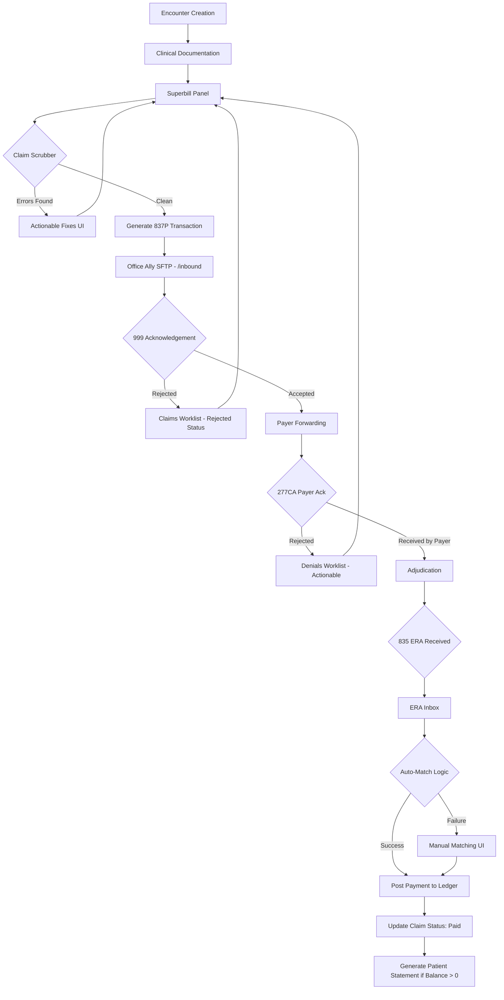

# Billing Life-cycle: Claim Submission Workflow

This flow documents the journey of a claim from encounter to payment in the ChartSpark Billing Module.

## Key Touchpoints
1. **Scrubbing Phase**: Real-time feedback in the Encounter view prevent rejections.
2. **SFTP Handshake**: `office-ally-service.ts` monitors the `/outbound` folder for `999` and `277CA` files.
3. **Revenue Posting**: `era-processor.ts` parses the `835` and matches it against `tenant_id` and `claim_id`.
