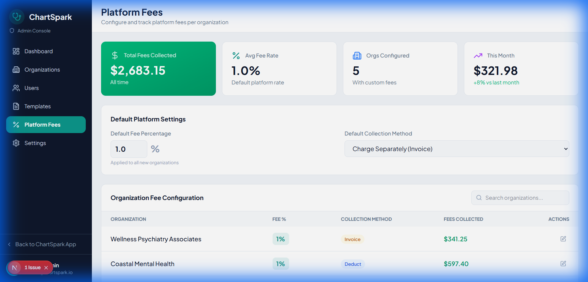
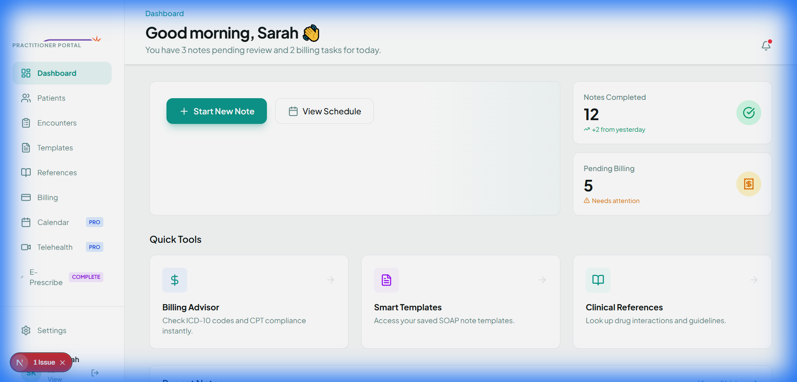
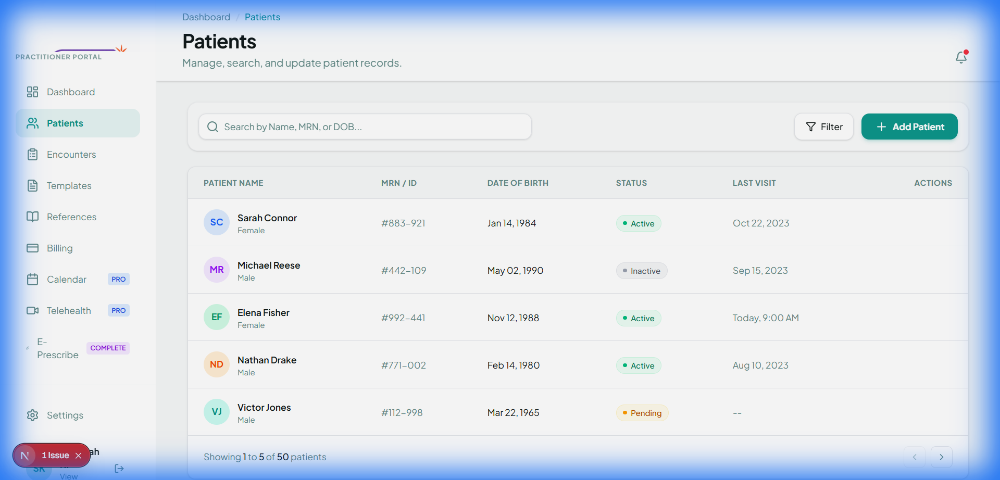
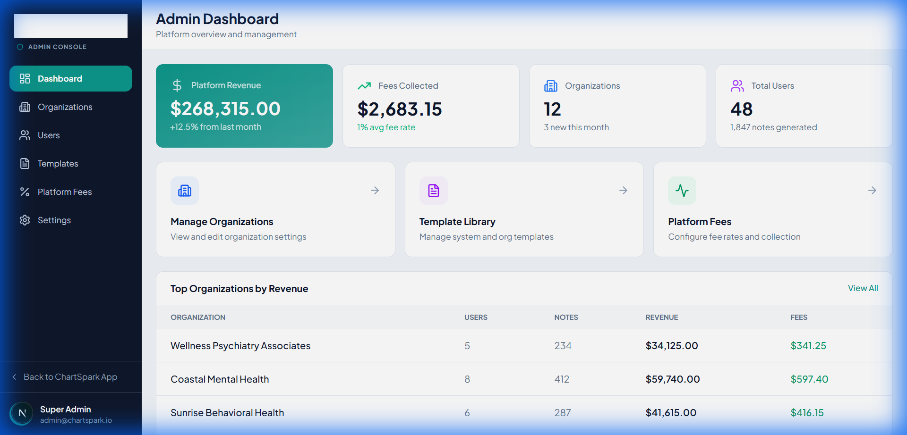

# ChartSpark Rebuild - Project Walkthrough

## Project Overview
ChartSpark is a modern clinical documentation platform for Nurse Practitioners, built with a focus on ease of use, HIPAA compliance, and insurance-optimized documentation.

### Core Tech Stack
- **Framework**: Next.js 16 (App Router)
- **Styling**: Tailwind CSS + shadcn/ui
- **Icons**: Lucide React
- **Typography**: Plus Jakarta Sans
- **Database/Auth**: Supabase (SSR Integration)

---

## Phase 1 & 2: Brand Foundation ✅
The application was rebranded from NP Toolkit to **ChartSpark**.
- Primary Color: Teal (`#0d968b`)
- Global Sidebar & Header layout implemented
- Mobile navigation support

---

## Phase 3 & 4: Practitioner Portal ✅
The main application features for managing patients, encounters, and clinical notes.

### Dashboard & Patients
- Actionable stats cards
- Smart quick-tools
- Comprehensive patient management with search/filter

### Templates & Note Editor
- **Primary Template**: Progress Note (SOAP format, optimized for insurance billing)
- AI-assisted note generation placeholders
- Template-driven billing code suggestions

---

## Phase 5 & 6: Admin Console ✅
A dedicated control panel for platform-wide management.
- Organization and User management
- **Platform Fee System**: Configure percentage-based fees (default 1.0%)
- Revenue and fee collection tracking

---

## Phase 7: Supabase Integration ✅
- **Secure Sessions**: SSR-compliant middleware protects all internal routes.
- **Client/Server Separation**: Fixed critical import errors between browser and server clients.
- **Database Schema**: Comprehensive `schema.sql` with tables for Orgs, Users, Patients, Notes, and RLS policies.
- **Resilient UI**: Graceful fallbacks for missing Supabase keys.

---

## Phase 8: Verification & Polish ✅
The application was refined to ensure a "premium" feel with attention to micro-interactions and visual depth.
- **Glassmorphism**: Headers and toolbars feature dynamic `backdrop-blur` effects.
- **Animations**: Implementation of smooth slide-in and fade-out transitions for all major page entries.
- **Enhanced Depth**: Refined shadows and borders on hover for cards and interactive table rows.

---

## Phase 9: Brand Logo Integration ✅
Official **ChartSpark** branding is now live across the platform.
- **Sidebar**: Tagline "Connected Care Solutions" is precisely cropped using CSS for a focused mark.
- **Auth Pages**: Full logo with tagline displayed on Login and Register pages.
- **Global Loading**: Smooth pulsating splash screen with the full logo.

---

## Verification Results
- [x] **WOW Factor**: Animations and glassmorphism provide a premium EHR experience.
- [x] **Consistency**: Rebranding and logo integration are 100% verified across all views.
- [x] **Security**: Middleware protects all internal routes while allowing demo fallback.
- [x] **Admin Guard**: Platform-wide controls and organization management are isolated and secure.
