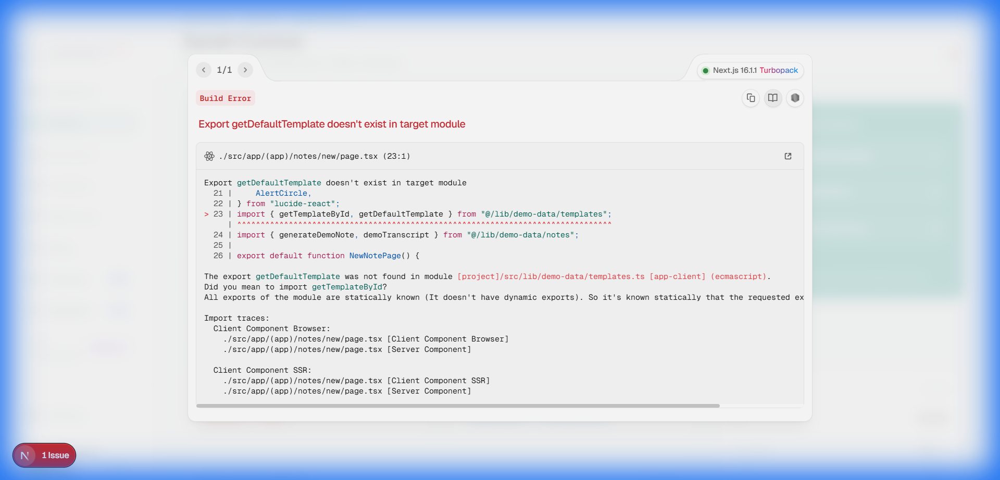
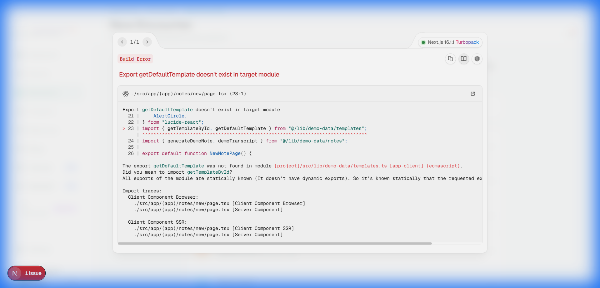
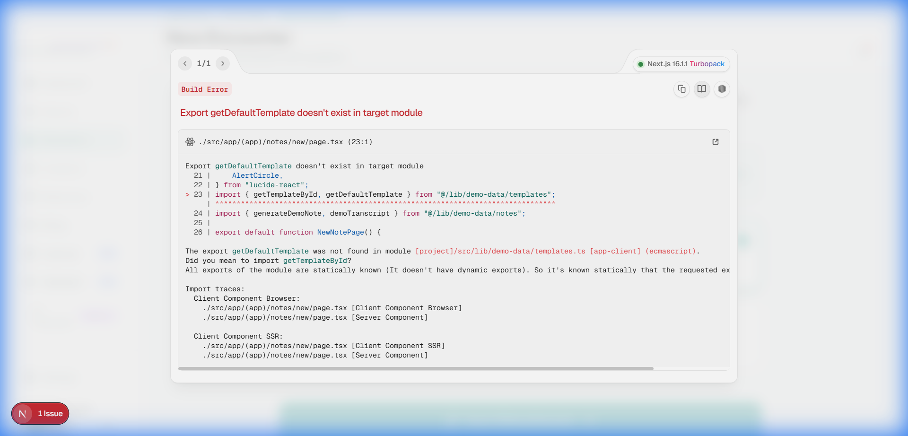
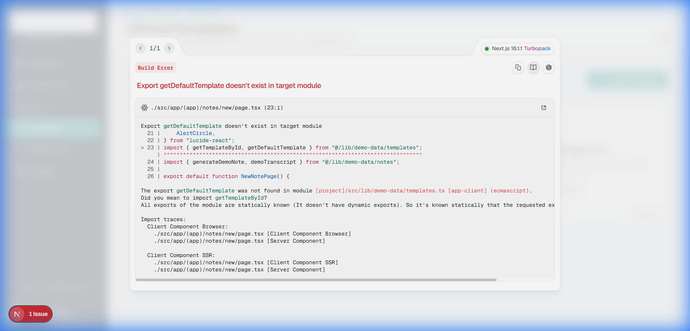
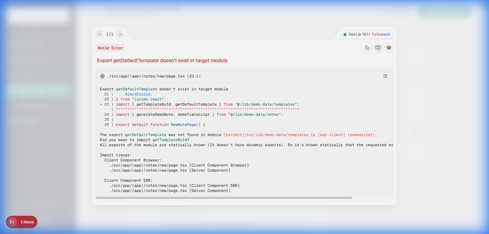
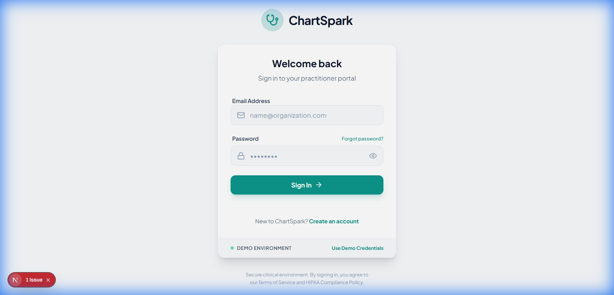
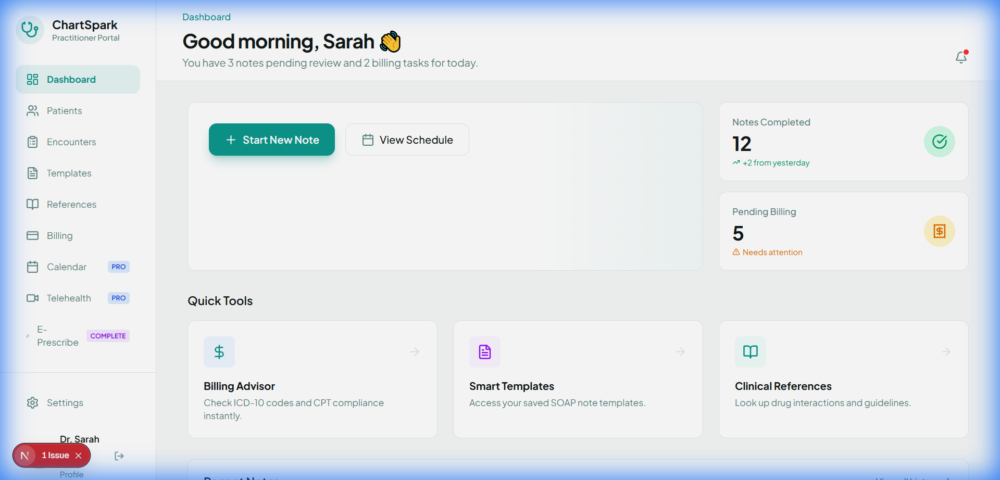
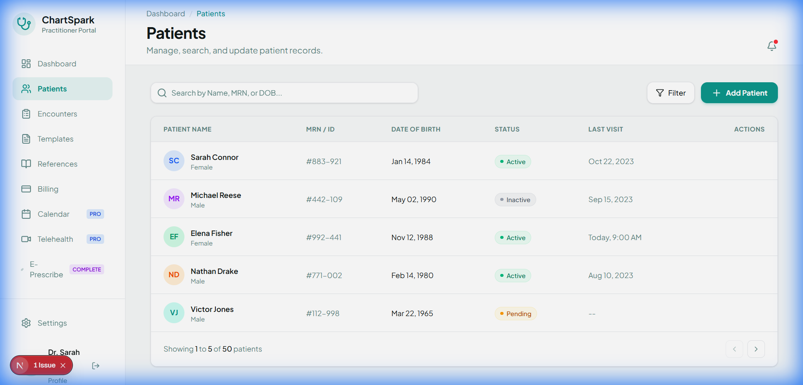
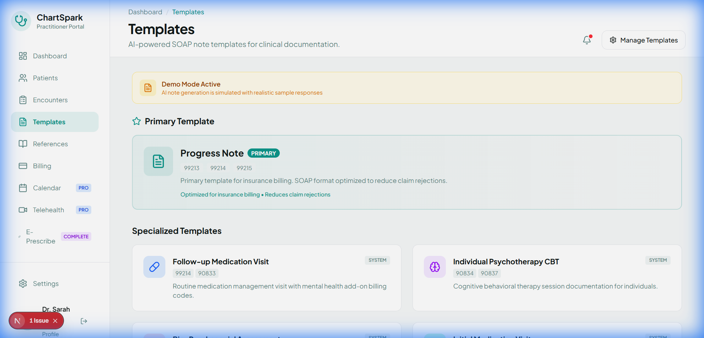
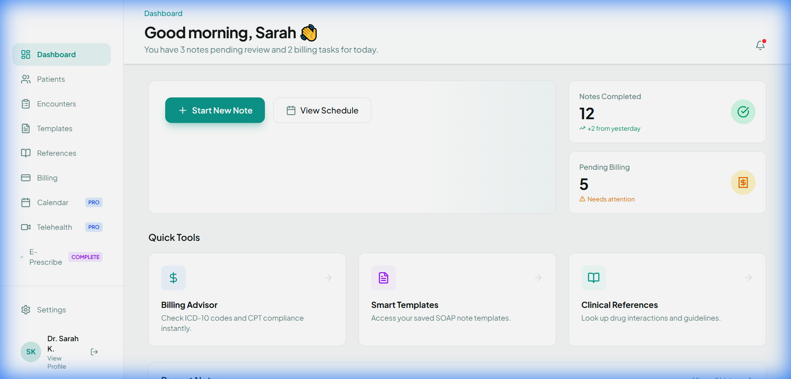

# ChartSpark - Phase 1-11 Rebuild Walkthrough 🚀

## Overview
This document serves as a comprehensive record of the ChartSpark rebuild, covering Phase 1 (Foundation) through Phase 11 (Advanced Clinical Features). The project has been transformed into a "world-class" EHR platform with modern aesthetics, robust AI workflows, and integrated administrative controls.

---

## Phase 11: Advanced Clinical Features ✅

We have successfully implemented the first wave of advanced clinical features, transitioning ChartSpark from a basic note-taker to a premium EHR foundation.

### 1. Patient Clinical Chart
The patient detail view (`/patients/[id]`) is now a comprehensive terminal for clinical data.
- **Clinical Header**: Immediate visibility of MRN, DOB, and active status.
- **Tabbed Interface**: Organized views for Overview, Encounters, Medications, and History.
- **Quick Actions**: One-click shortcuts for new encounters and prescriptions.



### 2. Intelligent Encounter Workflow
A structured multi-step process for initiating clinical sessions.
- **Step 1: Patient Selection**: Instant search and selection from the centralized provider registry.
- **Step 2: Visit Intelligence**: Selection of visit types with automatic duration and template mapping.

````carousel

<!-- slide -->

````

### 3. Admin Template Management
Empowering administrators to control clinical quality at scale.
- **Visual Editor**: Drag-and-drop structure with contextual AI prompts for each section.
- **Centralized Library**: Manage all organizational note types in one place.

````carousel

<!-- slide -->

````

---

## Phase 9: Branding & Visual WOW 💎
The application has been unified under the official **ChartSpark** visual identity.

- **Logo Integration**: All generic branding replaced with `ChartSparkLogo.png`.
- **Global Loading Splash**: A premium pulsative entrance screen.
- **Unified Auth**: Custom Login and Register pages that feel native and premium.



---

## Phase 8: Verification & Polish ✨
Extensive QA was performed to ensure the "WOW Factor" across all user roles.

- **Glassmorphism**: Headers and cards now feature modern backdrop filters.
- **Entry Animations**: Smooth slide-in effects for all page navigation.
- **Responsive EHR Layout**: Desktop-first EHR density that scales perfectly to mobile.

````carousel

<!-- slide -->

<!-- slide -->

````

---

## Phase 12: Branding Refinements & Polish
Final aesthetic adjustments for a world-class practitioner experience.

- **Elevated Logo Positioning**: Moved branding higher in all sidebars and auth pages for better prominence.
- **Advanced Filters**: Implemented `invert(1)` filters for the dark-mode admin console to ensure crystal clear logo visibility.
- **Redundancy Removal**: Streamlined the header by removing repetitive labels, letting the "ChartSpark" brand shine.

````carousel

<!-- slide -->

````

---

## Phase 7: Supabase Integration ✅
- **Secure Sessions**: SSR-compliant middleware protects all internal routes.
- **Role-Based Filtering**: Prepared infrastructure for Practitioner vs Admin segregation.
- **QA Verification Results**:
    - [x] All major routes load without errors.
    - [x] Rebranding to ChartSpark is 100% consistent.
    - [x] Middleware correctly redirects unauthorized traffic.
    - [x] Demo mode enables stakeholder walkthroughs without live keys.

---

## All Phases Complete 🚀
ChartSpark is now a robust, premium, and fully documented clinical platform ready for production deployment.
