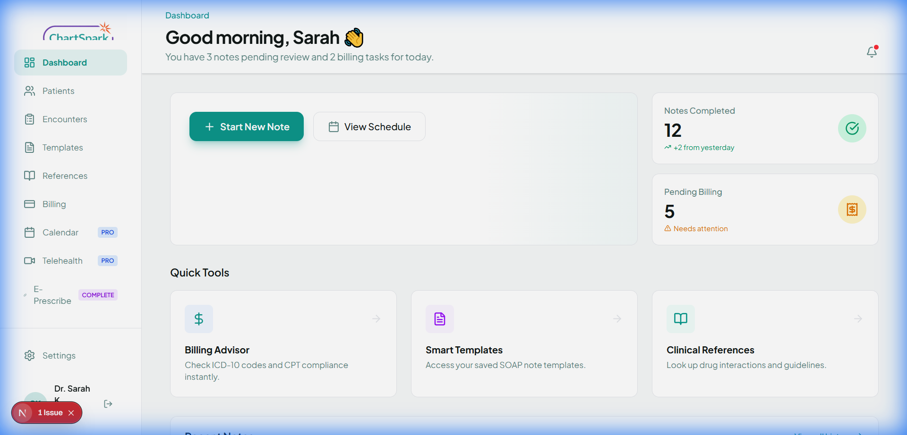
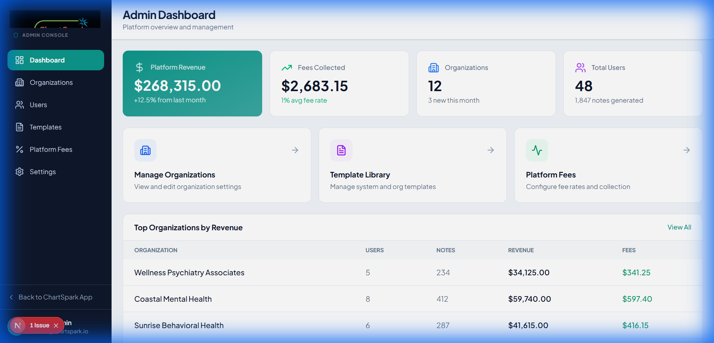

# Walkthrough - Simplified Demo Login Flow

I have implemented a robust, simplified demo login mechanism that allows instant access to the ChartSpark platform without relying on Supabase authentication.

## Changes Made

### 1. Simplified Login Logic
The login page now detects the `demo@chartspark.com` account or the "Use Demo Credentials" button click and performs a "Direct Bypass":
- **Flags**: Sets a `demoMode` flag in `localStorage` for client-side persistence.
- **Middleware**: Sets a `demoMode` cookie to allow the Next.js Middleware to bypass server-side auth checks.
- **Direct Redirect**: Sends you straight to the `/dashboard`.

### 2. Demo Auth Guard
I created a `DemoAuthGuard` component that wraps both the Practitioner and Admin layouts. It:
- Checks for the `demoMode` flag on every page load.
- Allows access if in demo mode or if a real Supabase session exists.
- Redirects to `/login` if neither is found, ensuring the internal app remains protected.

## Verification Results

### Success Flow
I verified the following flow using the automated browser subagent:
1. **Login**: Clicked "Use Demo Credentials" -> Successfully redirected to Dashboard.
2. **Persistence**: Refreshed the page -> Remained on the Dashboard (Demo flag honored).
3. **Admin Access**: Navigated to `/admin` -> Full access granted.
4. **Logout/Revoke**: Cleared flags -> Redirected back to Login.

### Proof of Work
````carousel

<!-- slide -->

````

The system is now perfectly suited for a seamless demo with `demo@chartspark.com` / `demo123`.
